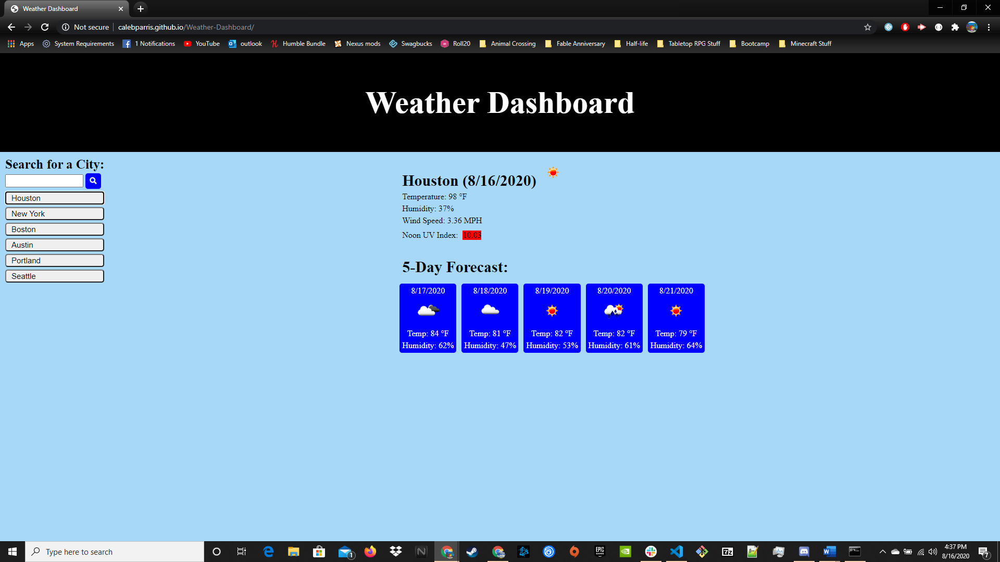

# Weather-Dashboard

## Objectives
The objectives of this homework to make a weather dashboard include:
* Using the Open Weather API to pull weather data
* Have a user input the name of the city they want to check the weather for
* When the city is searched, display it as an extra button that can be clicked to view the weather info for that city again
* Display the name of the city, current date and current weather condition icon
* Display the current temperature, humidity, wind speed, and a UV Index for the city
* Display a 5-day forecast that includes the temperature, humidity, date, and weather condition icon for each day
* When the page is refreshed, the last viewed city weather info is displayed

## Challenges and Solutions
* One of the challenges that I came across was connecting the user input city name to the open weather api to get the correct information. The way I solved this was by creating a variable that captured the value of the input field and use a parameter in the function calling the weather information that linked to the previously created variable. 
* Another issue I had was with the UV Index. This was difficult as the required queryies did not allow a city name, only the lattitude and longitude of the location being searched. To resolve this, I pulled the lattitude and longitude from the function that gets the current weather and set those as parameters for the function calling the UV index.
* A big issue I found was when I connected my code to the github url. This gave me a mixed content error and did not display any of the information I was trying to pull. After searching around Google for awhile, I found that it was due to my github url being https and the api url's were http. I tried to just changing them to https, however this did not work as the only way to make that work was with a paying subscription of open weather api. My work around was to use the cors-anywhere proxy infront of the http.

## Screenshots & Links
Here is a link to the app: https://calebparris.github.io/Weather-Dashboard/

Here is a screenshot of the working app:

